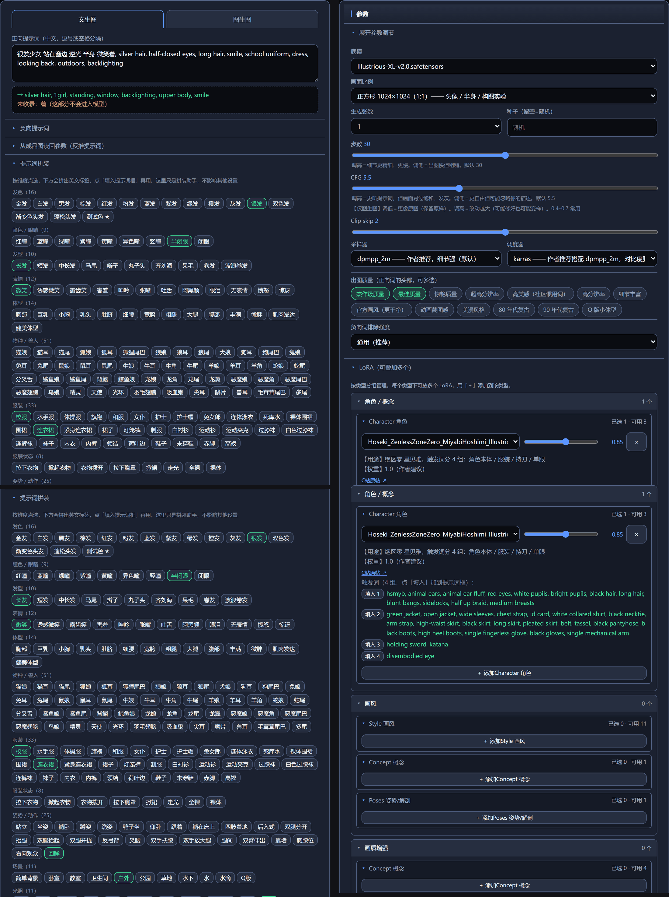

# Snakeer Drawing

### 会打字就能画图的 AI 绘画工具 —— 全中文界面

> 不用学 ComfyUI 的节点连线，不用记英文标签（还是要一丁点的，严谨.jpg），不用买会员、不用联网注册账号。
> 双击一个 `.bat` 就能用，你的提示词、参考图、成品图全部离线就能玩

<!--界面ui展示： -->


**作者 B 站主页**：<https://space.bilibili.com/1327027505>
工具 100% AI 写的代码喵，不要骂我喵。

---

## 先看这里：这个工具好在哪

| 亮点 | 说人话 |
|---|---|
| **中文直接写，也能中英混着写** | 打 `银发少女 站在窗边 逆光`，程序自动翻成 AI 认识的标签；懂行的直接写 `1girl, silver hair, window, backlighting` 也照收，中英混在一句里也没问题 |
| **完全不用碰 ComfyUI 的节点** | ComfyUI 很强但很劝退（一堆方块拉线）。这个工具把常用功能做成了按钮和下拉框，你只管打字和点选 |
| **功能一套齐全** | 出图、手绘草图锁形状、参考图搬风格、局部重绘修手、一键放大、随机灵感、从成品图反推参数，都在同一个界面里 |
| **对新手是真的友好** | 自带 32 万个标签的词库（其中 5 万个有中文对照）、中文说明、出错时直接告诉你**哪里错了、该怎么改**，而不是甩一串英文报错 |
| **不联网、不收费、不要账号** | 装好之后断网也能出图，没有积分、没有会员、没有敏感词审查，图只存在你自己电脑上 |

---

## 目录

- [三步开始用（最快路径）](#三步开始用最快路径)
- [电脑要什么配置](#电脑要什么配置)
- [详细安装步骤（一步一步来）](#详细安装步骤一步一步来)
- [模型放哪、装哪几个](#模型放哪装哪几个)
- [模型清单](#模型清单)
- [怎么换底模（换画风）](#怎么换底模换画风)
- [怎么装 LoRA / LoRA 去哪找](#怎么装-lora-lora-去哪找)
  - [下载的 LoRA 到底放哪个文件夹](#下载的-lora-到底放哪个文件夹复制粘贴就能用)
  - [它是怎么被分类的（四层判定）](#它是怎么被分类的四层判定从最可信往下)
- [界面怎么用](#界面怎么用)
- [配置文件](#配置文件)
- [出图存哪](#出图存哪)
- [遇到问题](#遇到问题)
- [更新](#更新)
- [目录结构](#目录结构)
- [许可](#许可)

---

## 三步开始用（最快路径）

给不想看长文的人：

1. 装好 **Python 3.12**（[python.org](https://www.python.org/downloads/) 的安装包版，勾 `Add Python to PATH`）
2. 装好 **ComfyUI**，并**先启动一次**（桌面版或便携版都行）
3. 下载本项目 → 把网盘模型丢进 `刚需模型全部放这` → 双击 `安装模型.bat` → 双击 `启动UI.bat`

浏览器会自己打开界面，在左边的框里打中文，点「生成」。

> 下面每一步都有详细版。哪一步卡住了，**先跳到最后那个 [遇到问题](#遇到问题)**，
> 或者跑一次 `python check_env.py` —— 它会直接告诉你缺什么、放哪、怎么改。

---

## 电脑要什么配置

| 需要 | 说明 |
|---|---|
| **Windows 10/11** | 只在这个平台测试过 |
| **一块显卡** | NVIDIA 显卡 8 GB 显存起步（1024×1024 出图）。6 GB 也能跑，把尺寸降到 832 |
| **ComfyUI** | 桌面版或便携版都行，能跑起来即可。本项目通过 HTTP 跟它通信 |
| **Python 3.10+** | 建议 3.12。[python.org 下载](https://www.python.org/downloads/) |
| **硬盘空间** | 模型 6.5–20 GB（看装几个，见[模型清单](#模型清单)）+ 出图占的空间 |

> **Python 千万别从微软商店装。** 商店版是个"转发器"，双击启动脚本会静默失败、
> 窗口一闪就没了，而且很难查。一定要用 python.org 的安装包版。
>
> 显卡是 N 卡最好（ComfyUI 对 N 卡优化最好）。A 卡、核显也能跑，但慢很多，
> 而且可能需要自己折腾 ComfyUI 那边的环境。

---

## 详细安装步骤（一步一步来）

一共七步。**第 5 步（放模型）是大头**，6.5 ~ 20 GB 看装几个，建议挂着下载去干别的。

### 1. 装 Python 3.12

1. 打开 <https://www.python.org/downloads/>，点黄色的 **Download Python 3.12.x**
2. 双击下载到的安装包
3. **第一屏底部有一个勾选框 `Add Python to PATH`，一定要勾上**（这是最容易漏的一步，
   漏了后面双击 `.bat` 会直接闪退）
4. 点 `Install Now`，等它装完

装完验证一下：按 `Win + R`，输入 `cmd` 回车，在黑窗口里打：

```bat
python --version
```

要能打出 `Python 3.12.x`。

- 如果打不出来、或者**自动弹出了微软商店**，说明你装的是商店版或者没勾 PATH ——
  去 python.org 下安装包版重装一次，记得勾 `Add Python to PATH`。

### 2. 装 ComfyUI 并启动一次

ComfyUI 是真正干活的"引擎"，这个工具只是它的中文遥控器。

1. 去 <https://www.comfy.org/download> 下载 **ComfyUI Desktop** 装上
   （或者用网上的便携版压缩包，解压即用，两者都行）
2. **装完先启动一次**，等它自己的网页界面出来
3. 然后可以把 ComfyUI 的网页关掉，但**别退出程序**（后面装模型要靠它建目录）

> 便携版的 `models`、`input`、`output` 三个文件夹在 ComfyUI 自己的目录下面。
> 桌面版在 `C:\Users\你的用户名\AppData\Local\Comfy-Desktop\ComfyUI-Shared\`。
> **不用记**，本程序会自动去找；找不到时跑 `check_env.py` 它会告诉你该往
> `config.json` 里填什么。

### 3. 下载本项目

会用 git 的话：

```bat
git clone https://github.com/SnakEER0721/snakeer-drawing-comfyui.git
```

不会用 git 的话：在仓库页面点绿色的 `Code` → `Download ZIP`，然后**解压**到
一个**路径里没有中文、没有空格**的地方，例如 `D:\snakeer-drawing`。

> ⚠️ 别放在桌面上、别放在"下载"里、别放在中文文件夹里 —— 有些模型和脚本
> 遇到中文路径会读不出来，图会莫名其妙出不来。
> 解压出来应该看到 `启动UI.bat`、`server.py`、`ui.html` 这些文件；
> 如果看到的是一层同名文件夹，就再进去一层。

### 4. 装 Python 依赖

进到项目目录（有 `启动UI.bat` 的那一层），在**地址栏里输入 `cmd` 回车**，
就能在这个目录打开命令行（比 `cd` 敲路径省事），然后打：

```bat
pip install Pillow opencv-python numpy
```

三条都显示 `Successfully installed` 就成了。

> 提示 `pip 不是内部或外部命令` = Python 没装好，回第 1 步。
> 提示下载超时 = 网络问题，重试一次，或者用国内的 pip 镜像：
> `pip install -i https://pypi.tuna.tsinghua.edu.cn/simple Pillow opencv-python numpy`

### 5. 装自定义节点（只有 1 个）

本应用**只需要一个**自定义节点包，其余用到的节点都是 ComfyUI 自带的。

- **参考图功能需要**：[ComfyUI_IPAdapter_plus](https://github.com/cubiq/ComfyUI_IPAdapter_plus)

装法：打开 ComfyUI 的 `custom_nodes` 目录（桌面版在
`...\Comfy-Desktop\ComfyUI-Shared\custom_nodes\`），在里面开命令行，然后：

```bat
git clone https://github.com/cubiq/ComfyUI_IPAdapter_plus.git
```

装完**重启 ComfyUI**。

> 不想装也行 —— 只是"参考图"这个功能用不了，其他功能都正常。
>
> 人脸自动蒙版（`MediaPipeFaceMask`）和深度图（Depth Anything 3）都用的是
> ComfyUI 自带节点，但需要 ComfyUI 版本够新（0.35+）。如果你的 ComfyUI 比较旧，
> 跑 `check_env.py` 会告诉你缺哪些。

### 6. 放模型

**这一步最容易卡住，所以做成了一个脚本，你只要把文件丢进一个文件夹。**

1. 打开网盘链接（见[模型清单](#模型清单)），把里面的 `刚需模型.zip` 下载下来
2. 解压它。解压出来会看到一个叫 `刚需模型` 的文件夹，里面有 8 个模型文件
3. 把 `刚需模型` 里的**所有文件**（不是文件夹本身）**全选、复制**，
   粘贴到本项目目录下的 **`刚需模型全部放这`** 文件夹里
   —— 不用管哪个文件该进哪个子目录，脚本会按文件名认，一律扔进去就行
4. 回到项目目录，**双击 `安装模型.bat`**，看着它跑完

脚本会自动把每个文件放到 ComfyUI 对应的目录，并把 `config.json` 的底模改成
实际装进去的那个。想先看看会怎么搬、不动文件：`python install_models.py --dry`。

- 认不出来的文件**不会被动**，只会列在屏幕上让你自己判断
- **下坏的文件也不会被动**：脚本会先看一眼内容 —— 大小远小于清单、或者开头
  根本不是模型文件（网盘链接过期时下到的往往是一张网页），它会把这几个列出来
  并告诉你重新下载，而不是把坏文件搬进去让你之后对着一个加载不了的模型发愁
- 装完再跑一次也不会出错，已经装好的会自动跳过

> **不知道 ComfyUI 的模型目录在哪？** 看它输出最后那几行，或者在
> `安装模型.bat` 跑完后打开 `config.json`，里面 `models_dir` 写的就是它。

### 7. 自检

```bat
python check_env.py
```

它会逐项检查 Python 依赖、路径配置、词库、ComfyUI 连接、模型文件，
**缺什么、放哪里、怎么修都写清楚**。看到 `0 项缺失` 就齐了。

### 8. 启动

**先确认 ComfyUI 开着**，然后双击 **`启动UI.bat`**。

浏览器会自动打开。**端口以浏览器地址栏为准** —— 默认 8765，被占用了会自动往上找。

关掉那个黑窗口 = 停止服务。

---

## 模型放哪、装哪几个

全部 **19 GB**。放好之后双击 `安装模型.bat` 即可。

| 想装多少 | 包含 | 体积 |
|---|---|---|
| **最少能用** | 底模 + 放大模型 | **6.5 GB** |
| **推荐** | 再加 3 个 ControlNet（草图 / 姿势 / 局部重绘） | **13.5 GB** |
| **全部** | 再加构图迁移 + 参考图那套 | **19 GB** |

**网盘链接**：[百度网盘](https://pan.baidu.com/s/1cihBoLiZ4XYH9T37xIGDrQ?pwd=0721)　提取码 `0721`

下载的是一个 `刚需模型.zip`（约 17 GB，里面是下面这些文件）。解压出来是个
`刚需模型` 文件夹，把里面**所有文件**丢进本目录下的 `刚需模型全部放这`
（名字不一样没关系，它只是个中转站），然后双击 `安装模型.bat` 即可。

### 每个文件是干什么的、想自己下从哪下

**最后一列是"少了它你有什么感觉"** —— 想省硬盘就按那一列砍。底模和放大模型
是**最少能用**的组合（6.5 GB），其余都是"某个功能用不了"，不影响出图。

| 文件 | 大小 | 作用是 | 少了会怎样 | 想自己下（点名字） | 下载后要改名吗 |
|---|---|---|---|---|---|
| `Illustrious-XL-v2.0.safetensors` | 6.5 GB | **底模**：决定画风的就是它，所有图都由它生成 | **什么图都出不来** ✅必需 | [OnomaAIResearch/Illustrious-XL-v2.0](https://huggingface.co/OnomaAIResearch/Illustrious-XL-v2.0)（官方，社区叫它"光辉"） | 不用，原名就对 |
| `RealESRGAN_x4plus_anime_6B.pth` | 17 MB | **放大**：动漫专用超分，线条最干净、不糊边 | 界面上的「放大」用不了 | [Real-ESRGAN 官方 Release 资产直链](https://github.com/xinntao/Real-ESRGAN/releases/download/v0.2.2.4/RealESRGAN_x4plus_anime_6B.pth)（点开就开始下，17 MB） | 不用，原名就对 |
| `controlnet-scribble-sdxl.safetensors` | 2.3 GB | **草图**：你在画板上手画的线，照原样锁住形状（**默认就是它**） | 「草图」用不了 | [xinsir/controlnet-scribble-sdxl-1.0](https://huggingface.co/xinsir/controlnet-scribble-sdxl-1.0) 里的 `diffusion_pytorch_model.safetensors` | **要**（改成左边这个文件名） |
| `controlnet-openpose-sdxl.safetensors` | 2.3 GB | **姿势**：锁住人形姿势。注意要**渲染好的骨架图**（彩色四肢）才认 | 「姿势」用不了 | [xinsir/controlnet-openpose-sdxl-1.0](https://huggingface.co/xinsir/controlnet-openpose-sdxl-1.0) 里的 `diffusion_pytorch_model.safetensors` | **要**（改成左边这个文件名） |
| `noobaiInpainting_v10.fp16.safetensors` | 2.3 GB | **局部重绘专用**：纹理、瞳色的保真度明显比通用模型好（修手、换表情） | 局部重绘还能用，但**画质差一截** | [Acly/NoobAI-Inpainting](https://huggingface.co/Acly/NoobAI-Inpainting) | 不用，原名就对 |
| `controlnet-union-sdxl-xinsir.safetensors` | 2.3 GB | **构图迁移**：把参考图的构图搬过来（参考图 → 深度图 → 这里） | 「构图迁移」用不了 | [xinsir/controlnet-union-sdxl-1.0](https://huggingface.co/xinsir/controlnet-union-sdxl-1.0) 里的 `diffusion_pytorch_model.safetensors` | **要**（改成左边这个文件名） |
| `ip-adapter-plus_sdxl_vit-h.safetensors` | 0.8 GB | **参考图**：把一张图的人物/风格带进新图 | 「参考图」用不了（还要装第 5 步那个节点） | [h94/IP-Adapter](https://huggingface.co/h94/IP-Adapter) 的 `sdxl_models/ip-adapter-plus_sdxl_vit-h.safetensors` | 不用，原名就对 |
| `CLIP-ViT-H-14-laion2B-s32B-b79K.safetensors` | 2.4 GB | 上面那个参考图的**配套**，两个必须同时装 | 同上（两个缺一个都不行） | [h94/IP-Adapter](https://huggingface.co/h94/IP-Adapter) 里的 **`models/image_encoder/model.safetensors`** | **要**（改成这个名字） |

> 三个 ControlNet 在 HuggingFace 上的下载文件名全都叫 `diffusion_pytorch_model.safetensors`
> —— 一模一样，下完分不清谁是谁。**下完立刻改成表里那个名字**（这也是网盘包
> 最省事的地方：里面已经改好了）。
>
> ⚠️ `CLIP-ViT-H-14-...` **别去 `laion/CLIP-ViT-H-14-laion2B-s32B-b79K` 拿** ——
> 那个仓库里是 3.7 GB 的完整检查点（带文本编码器），ComfyUI 的 `CLIPVisionLoader`
> 加载不了。要的是 `h94/IP-Adapter` 里那份（sha256 开头 `6ca9667d…`）。
>
> HuggingFace 在国内**直连不上**，需要自备网络工具 —— 所以这里还是直接给网盘
> 最省事。各模型的许可见 [THIRD-PARTY.md](THIRD-PARTY.md)。

> 体积按 Windows 资源管理器显示的那种 GB（也就是 1024 进制），和你在网盘里
> 看到的大小应当一致。

**文件名的最后一段必须一模一样** —— 脚本靠文件名认它是什么，改过名就认不出来了；
名字对不上它会**原样不动地列出来**让你自己判断，不会瞎搬。

装完之后它们分别在 ComfyUI 的哪里（想自己手动放的话照这个表）：

| 文件 | 该放进 ComfyUI 的哪个文件夹 |
|---|---|
| `Illustrious-XL-v2.0.safetensors` | `models\checkpoints\` |
| `controlnet-*.safetensors`、`noobaiInpainting_*` | `models\controlnet\` |
| `RealESRGAN_x4plus_anime_6B.pth` | `models\upscale_models\` |
| `ip-adapter-plus_sdxl_vit-h.safetensors` | `models\ipadapter\` |
| `CLIP-ViT-H-14-laion2B-s32B-b79K.safetensors` | `models\clip_vision\` |

> 手动放的时候**别改扩展名、别改成中文名**，放完**重启 ComfyUI** 才会认。
> 拿不准就直接用 `安装模型.bat`，那是最省事的做法。

<a id="模型清单"></a>

## 模型清单

上面那套东西的**一句话速查**，方便你回头找：

- 网盘里那个 `刚需模型.zip` 里就是[模型放哪、装哪几个](#模型放哪装哪几个)那节列的 8 个文件；
  `安装模型.bat` 会自动把它们放进 ComfyUI 的对应目录
- **每个文件干什么用、下载链接、下载后要不要改名**：见上面那张
  [每个文件是干什么的、想自己下从哪下](#每个文件是干什么的想自己下从哪下)
- 各模型的**许可**在 [THIRD-PARTY.md](THIRD-PARTY.md) 里
- 只想**最少跑起来**：底模 `Illustrious-XL-v2.0.safetensors` + 放大模型
  `RealESRGAN_x4plus_anime_6B.pth` 两个文件就够（6.5 GB）

---

## 怎么换底模（换画风）

**底模 = 决定画风的那个大文件**（6.5 GB 起步），换一个底模，出图的画风、画得像不像、
偏不偏写实都会变。`.safetensors` 结尾的都可以当底模（SDXL / Illustrious 这一系）。

**默认底模**：`Illustrious-XL-v2.0.safetensors` —— **Illustrious-XL 官方 v2.0**
（社区叫它"光辉"）。默认参数（步数 30 / CFG 5.5 / CLIP skip 2 / dpmpp_2m + karras）
和内置负向词都是照它调的，装上就能直接出好图。

**换法一共三步：**

1. **下载**新的底模（`.safetensors` 文件）。哪里找：
   - [Civitai](https://civitai.com/)（免费，模型最多，筛 `Checkpoint` + 底模选 `Illustrious` 或 `SDXL`）
   - [HuggingFace](https://huggingface.co/)（官方模型基本都在这儿，国内要自备网络工具）
2. **放进这个文件夹**：ComfyUI 的 `models\checkpoints\`
   - 桌面版：`C:\Users\你的用户名\AppData\Local\Comfy-Desktop\ComfyUI-Shared\models\checkpoints\`
   - 便携版：`你解压 ComfyUI 的地方\ComfyUI\models\checkpoints\`
   - **文件名别改成中文**，中文名有可能加载不了
3. **重启 ComfyUI**，然后刷新本工具的页面 —— 右栏「底模」下拉框里就会多出这个新模型，
   选它就行

> **换成别的底模之后，参数可能要自己调一下**：本应用的默认参数是照
> Illustrious-XL 官方 v2.0 调的。换成别的模型**能用，但参数要你自己试**
> （一般先动 CFG 和步数）；试几组就知道哪个顺眼。
>
> 页头还会显示当前用的是哪个底模；出过的图里也记着当时用的底模，拖回界面能还原。

---

## 怎么装 LoRA / LoRA 去哪找

**LoRA = 给底模加的小补丁**（几十 MB 到几百 MB），用来加一个角色、一种画风、
一套服装。可以同时叠好几个。

**本项目不附带任何 LoRA**（别人的收藏对你没用）。自己找、自己装：

### 去哪找

- **[Civitai](https://civitai.com/)**（首选，免费、量最大。国内要自备网络工具）
  - 筛 `LoRA` + 底模选 `Illustrious` 或 `SDXL` —— **底模系要跟你的底模对上**，
    对不上会出现"加了没反应"或者画面崩坏
  - 每个 LoRA 的页面右上角有 `Download`，下 `.safetensors` 那个文件
- Civitai 打不开的话，国内的模型站（如 LiblibAI 等）也有 LoRA，
  同样是挑 Illustrious / SDXL 底模的，下 `.safetensors` 文件

### 怎么装（三步）

1. 把下载到的 `.safetensors` 文件放进 ComfyUI 的 **`models\loras\`** 文件夹
2. **重启 ComfyUI**（LoRA 列表是它启动时读的）
3. 刷新本工具的页面，左栏「LoRA（可叠加多个）」面板里就能看到了

### 下载的 LoRA 到底放哪个文件夹（复制粘贴就能用）

放错地方是这一步最常见的失败 —— 文件塞在 `下载` 里、塞在 ComfyUI 安装目录根下、
或者塞进 `models\checkpoints\`（底模那格），界面上就永远看不到它。
**认准路径里必须有 `models\loras`**：

| 你装的是哪种 ComfyUI | 完整路径（把 `你的用户名` 换成你自己的） |
|---|---|
| **桌面版** | `C:\Users\你的用户名\AppData\Local\Comfy-Desktop\ComfyUI-Shared\models\loras\` |
| **便携版** | `你解压 ComfyUI 的地方\ComfyUI\models\loras\` |

要找这个文件夹的笨办法（最稳）：**在 ComfyUI 里随便出一张图，再去它的 `output`
文件夹的上一层** —— 那一层里就有 `models`，进去找 `loras`。
或者直接跑一次 `python check_env.py`，它会把这个目录的**完整路径打印出来**。

几条硬规矩：

- **只放 `.safetensors`**。`.ckpt`、`.pt` 是给别的框架用的，这里不认
- **文件名别改**（尤其别改成中文名）。改名的唯一好处是好看，坏处是查不到 C站资料、
  分类直接变成"文件名猜的"
- **放完必须重启 ComfyUI** —— LoRA 列表是它启动时扫一次，之后不再看
- **可以建子文件夹分类**（比如 `loras\角色\`）ComfyUI 认，但本工具的 LoRA 面板
  **不按文件夹分组**，按的是下面的"分类"（角色 / 画风 / 服装…）。所以你想整齐
  就建子文件夹，想好用就看分类对不对，两件事互不干扰
- 放完刷新本工具的页面（**不用重启本工具**，只要页面刷新）

> ⚠️ 一个 LoRA 明明放对了、界面上却没有，先看它是不是**格式不兼容** ——
> `python check_env.py` 会标出来。这种 LoRA 能加载但不生效，最容易误判成"模型坏了"。

### 它是怎么被分类的（四层判定，从最可信往下）

你没有手动标过的时候，程序按下面这个顺序定类型，**前面命中就不看后面**。
越往下的越容易猜错 —— 所以界面会把用的是哪一层直接写给你看：

```
① 你自己标的？            ✓ → 「来源：你标的」   ← 永远最高，压过下面全部
      ↓ 没有
② 格式不兼容？            ✓ → 「不兼容」，单独一组放最后
      ↓ 不是
③ 文件指纹在 C站资料库里查得到？
      作者给的真名 → 作者挂的标签，依次比对
                          ✓ → 「来源：C站数据」
      ↓ 查不到 / 都对不上
④ 模型文件里带训练元数据吗（kohya 训练时会写进去）？
      只改图像模型、没动文本编码器 → 角色 / 概念
      同时改了文本编码器             → 画风 / 概念
                          ✓ → 「来源：文件元数据推的」
      ↓ 没有元数据
⑤ 文件名里有 style / character / pose 之类关键词吗？
                          ✓ → 「来源：文件名猜的」
      ↓ 没有
⑥ 文件很小（不到 150 MB）？  → 画质增强   ┐
      其余                        → 其他      ┘ → 「来源：按体积猜的」「没判断出来」
```

（第 ③ 层用的那个资料库随包发布，见下面[内置的 LoRA 资料库](#内置的-lora-资料库lora_catalogjson)；
它按文件的 SHA256 认人，所以**你改了文件名也照样认得出**。）

**还有一个独立的维度叫「子分类 / `category`」**（角色 / 画风 / 服装 / 姿势 /
背景 / 概念 / 工具… 这十几个，用的是 C站那套说法），下拉框里按它的名字分组。
它和上面的"类型"是同一批证据算出来的，绝大多数时候两者一致；
真出现互相矛盾的时候（比如分类说是"画风"、类型却判成"画质增强"），
**以「类型」为准** —— 这也是为什么界面上那个来源小字只跟着"类型"显示。

**怎么改**：不用改文件，每条 LoRA 下面的 **「改名字/分类」** 按钮直接改，
你的判断会**永远压过软件**（第 ① 层）。猜错了不用忍。


### 怎么用

- 面板按类型分组（角色 / 画风 / 服装 …），在对应分类点 **「＋」** 添加，
  可以叠加多个；**角色 LoRA 权重建议 0.7–0.9；多个叠加时各降到 0.4–0.6，最多 3 个**
  （这是 LoRA 面板下面的说明文字，权重太高画面会崩）
- 挂上之后，LoRA 的**触发词**会显示出来，点旁边的按钮把它加进提示词框
  （不会自动加，由你决定用哪一组）
- 图里的 LoRA 也会记进 PNG，拖回界面能还原

### 每个 LoRA 下面那行小字是什么

每一条 LoRA 下面都会显示**它是靠什么被判断出来的**，一眼能看出靠不靠谱
（这行小字对应的是上面[四层判定](#它是怎么被分类的四层判定从最可信往下)里实际命中的那一层）：

| 面板上写的 | 意思 | 要不要管它 |
|---|---|---|
| `来源：你标的` | 你自己在界面里改过名字/分类 | 不用，以你为准 |
| `来源：C站数据` | 用文件指纹从 Civitai 查到的公开信息 | 一般都对 |
| `来源：文件元数据推的` | 从模型文件自带的说明里推的 | 有时会偏，可以自己改 |
| `来源：文件名猜的` | 只看文件名猜的（名字里带 `style`/`character` 之类） | ⚠️ 容易猜错，建议改 |
| `来源：按体积猜的` | 文件小、又没有任何线索，只能按体积猜（不到 150 MB 猜画质增强） | ⚠️ 建议自己标一下 |
| `来源：没判断出来` | 什么都对不上，先丢进「其他」 | ⚠️ 建议自己标一下 |

同一行里还会带上查到的 **C站真名**、**底模**、**作者推荐权重**、**`#标签`** ——
文件名是一串哈希（`8be1e5d2….safetensors`）的时候，只有这几样能告诉你
"这到底是个什么东西"。

LoRA 下拉框里中文名后面也会写一句它是哪来的（`（748cm画风 · C站自动）`、
`（我的角色 · 你改的）`），免得分不清"这个名字是我自己起的还是软件自动填的"。

### 分类猜错了 / 想给 LoRA 起中文名：点「改名字/分类」

不需要手动改文件了。每条 LoRA 下面都有一个 **「改名字/分类」** 按钮：

1. 点它 → 填中文名（最多 40 字）→ 选类型（角色 / 画风 / 画质增强 / 其他）
2. 点「保存」→ 面板当场更新，**你的判断永远压过软件的猜测**
3. 类型选「自动判断」= 交回给软件猜

写完就存在项目根目录的 `lora_aliases.json` 里（这个文件是你的私人数据，
不会进仓库）。**不过下面这些事还是得改文件**：写详细备注（`note`）、
填 C站链接（`url`）、手工指定触发词（`triggers_source`）—— 界面上没有这三样的
编辑器。

### LoRA 中文名与备注（要改文件的那部分）

备注文件是项目根目录的 `lora_aliases.json`。

包里那个 `lora_aliases.example.json` 是个空的 `{}` —— **复制一份、改名成
`lora_aliases.json`**，然后照着这个写：

```json
{
  "example_character_v2.safetensors": {
    "alias": "我的角色",
    "note": "某个角色，秋叶校服那套\n（说明里可以换行）",
    "url": "https://civitai.com/models/123456",
    "triggers_source": ["example_char", "blue eyes"],
    "kind": "character"
  }
}
```

| 键 | 面板上会显示成什么 |
|---|---|
| `alias` | LoRA 下拉框里显示的中文名（同时让你能在提示词里打中文调用） |
| `note` | 鼠标停在选项上、以及展开后的说明文字（支持换行） |
| `url` | 一个「C站原帖 ↗」链接 |
| `triggers_source` | 触发词列表，每个后面跟一个「填入」按钮 |
| `kind` | 手动指定分类：`character` / `style` / `quality` / `other`（界面里点按钮写的就是这个键） |
| `source` | 不用管，是自动标注过来源的标记 |

> ⚠️ 只有上面这几个键有用。**拼错键名不会有任何报错**，只是面板上什么都不出现
> —— 比如写成 `words` 就等于没写。写完刷新页面即可（不用重启服务）。
>
> ⚠️ 存成 UTF-8 编码（记事本"另存为"时把编码选成 **UTF-8**），否则中文会变乱码。

> 装 LoRA 前可以看 `check_env.py` 的输出 —— 它会标出**格式不兼容的 LoRA**
> （加载了但不生效），这种最容易误以为是模型问题。

### 内置的 LoRA 资料库（`lora_catalog.json`）

包里带了一个 `lora_catalog.json`，是**作者机器上那 22 个 LoRA 的公开资料**
（模型真名 / 底模 / 作者声明的触发词 / 标签 / 链接，按文件 SHA256 存，
**不含任何本机路径**）。作用是：你装了同一个 LoRA 时，界面能自动显示它的真名、
底模和触发词，分类也更准，不用你自己一个个查。

- **装了别的 LoRA？** 完全不影响 —— 查不到就自动退回"文件元数据 → 猜文件名"，
  界面上会照实写「来源：文件名猜的」，不会瞎编一个来源给你。
- **想给更多 LoRA 生成资料？** 把自己的 LoRA 放进 `models\loras\`，然后在项目
  目录里跑：

  ```
  python dev/make_lora_catalog.py            # 算哈希 + 查 C站，生成 lora_catalog.json
  python dev/make_lora_catalog.py --enrich   # 文件没变，只重新抓一遍 C站信息
  python dev/make_lora_catalog.py --no-net   # 不联网，只用文件里的信息
  ```

  它需要联网访问 Civitai。生成的 `lora_catalog.json` 可以直接留着自用，
  也可以发给作者合进下一版。
- **不想要它可以删掉** —— 删了只是分类变回"猜"，其他功能一律不受影响。

---

## 界面怎么用

界面分三栏，从上到下按顺序用就行：

**左栏** —— 输入和拼装

- 顶上那个大输入框：直接打中文，用空格或逗号分隔
  （`银发少女 站在窗边 逆光 半身`）
- 也可以**中英混着写**：`银发少女, looking at viewer, 逆光`，英文部分原样送过去，不会被翻坏
- 下面那个「提示词拼装」面板：按章节组织的中文选项（发色 / 表情 / 服装 / 姿势 / 场景 …），
  点一下**选中**（底部会显示选了几项、以及"拼出"的预览），
  选好一批再点 **「填入提示词框」** 一次性加进去，不用背英文标签。
  再点一下同一个词就是取消选择，已经填进框里的那个标签也会一起拿掉
  （免得换发色时新旧两个都在）
- 输入框下面实时显示翻译结果，**出图前看一眼**，翻译错了直接改英文

**中栏** —— 图和蒙版

- 出图区域，点缩略图站内放大，`←` `→` 翻页
- 局部重绘的蒙版编辑器在这里，滚轮可以放大细看

**右栏** —— 参数

- **底模**下拉框：换底模（换完参数要自己调，见[怎么换底模（换画风）](#怎么换底模换画风)）
- 尺寸、步数、CFG、采样器、种子
- 局部重绘的羽化、外扩
- 草图 / 姿势 / 构图迁移 / 参考图的开关和强度
- 「放大」按钮

**几个实用技巧**：

- **种子填 -1** = 每次随机；出一张满意的，把种子记下来就能复现
- **构图不满意**：尺寸选「自定义」调成 `768×768`、步数降到 15 快速试，
  构图定了再调大重出
  （界面最小就是 768 —— SDXL 是按约 100 万像素训练的，再小画面会崩、人物会重复）
- **手画不好**：用局部重绘框住手，蒙版外扩大一点（16~20），重画
- **想把一张图的风格搬过来**：用「构图迁移」，不是「参考图」。
  参考图带的是人物和整体氛围，构图迁移只搬结构

---

## 配置文件

`config.json`。**留空或删掉某一项 = 自动探测**，所以大多数情况不用改。

```jsonc
{
  "comfy_url":   "http://127.0.0.1:8188",  // ComfyUI 地址
  "comfy_input": "",                        // 留空自动探测
  "comfy_output": "",                       // 出图目录，留空 = 用 ComfyUI 自己的 output
  "models_dir":  "",                        // models 根目录，留空自动探测
  "checkpoint":  "Illustrious-XL-v2.0.safetensors",  // 默认底模（官方 Illustrious-XL v2.0）
  "staging_dir": "",                        // 新 LoRA 的暂存目录
  "port":       8765                        // 网页服务端口
}
```

**路径逻辑只有一处**（`paths.py`），四级回退：
`config.json` > 环境变量 > 自动探测 > 应用目录下的兜底。

改完跑一遍 `python check_env.py` 确认。

---

## 出图存哪

默认在 ComfyUI 的 `output\anime\<日期>\` 下：

```
output/
  anime/
    2026-09-18/
      t2i_20260918_143022_1234.png     # 文生图
      up_20260918_150311_5678.png      # 放大后的
    2026-09-18_depth/                   # 构图迁移的中间深度图
    _recycle/                           # 「删除」的东西进这里，想彻底清空自己删
```

出图是 PNG，**参数写在 PNG 的元数据里** —— 拖回界面就能还原当时的提示词和设置。

想换地方：改 `config.json` 的 `comfy_output`。

---

## 遇到问题

**先跑这个**：

```bat
python check_env.py
```

八成的问题它能直接指出原因和改法。下面是几个常见的：

<details>
<summary><b>双击 <code>启动UI.bat</code> 窗口一闪就没了</b></summary>

Python 没装好，或者装的是微软商店版。

开一个命令行，`cd` 到项目目录，直接跑 `python server.py`，就能看到真正的报错。

如果提示"没有找到可用的 Python"，去 python.org 下安装包版重装，
安装时勾选 `Add Python to PATH`。
</details>

<details>
<summary><b>点「生成」提示"连不上 ComfyUI"</b></summary>

ComfyUI 没开着（或者地址不对）—— 这是最常见的一种。

1. 确认 ComfyUI 自己开着，而且**它自己的界面已经出来了**（它启动要一会儿）
2. 如果你把它开在别的地址或端口，改 `config.json` 里的 `comfy_url`
3. 还不行就跑 `python check_env.py` —— 它会写出**它实际在连的地址**，对不上就照第 2 步改

界面上点一次生成，状态栏就会写出**它实际连的地址** —— 照着那个地址核对。
</details>

<details>
<summary><b>生成了但界面里没有图 / 图跑到别处去了</b></summary>

多半是出图目录没对上：ComfyUI 有它自己的 `output`，本工具也可以指定
（`config.json` 的 `comfy_output`）。跑一次 `python check_env.py`，
它会写出**它现在认为的出图目录**是哪个，去那个文件夹里看有没有新图。

在界面上点「打开文件夹」，也能直接打开它正在用的目录。
</details>

<details>
<summary><b>下载到的模型装不上 / 装完出图报错</b></summary>

先看大小 —— 网盘链接过期时，下到的往往是一张几十 KB 的网页，而不是几个 GB 的模型。
`安装模型.bat` 会检查内容，坏文件它会列出来让你重下。

再对一下**文件名**：脚本靠文件名认模型，改过名（尤其是改成中文名）就认不出来了。
</details>

<details>
<summary><b>改了 <code>config.json</code> 却没生效</b></summary>

它是 JSON，**格式写错一个字，整个文件都不会被读进来** —— 应用会退回"自动探测"，
你填的路径一个都不用，图跑到别处去。页头这时会出现一个红色「配置有问题」标签，
状态栏里写着具体原因。

最常见的三种：

1. **多一个逗号**（最后一项后面不能有逗号）、少一个引号
2. **编码不是 UTF-8**：记事本里选"另存为"时把编码选成 **UTF-8**
   （选成 ANSI 就会读不出来）
3. 最外层没写成 `{ }`

修好它就行。嫌麻烦也可以**直接把这个文件删掉**，再跑一次 `安装模型.bat` ——
它会用旁边的 `config.example.json` 生成一份带中文说明的新文件。
（覆盖前应用会把你原来那份另存成 `config.json.bak`，不会直接丢掉。）
</details>

<details>
<summary><b>页面打不开 / 一片空白</b></summary>

1. 确认那个黑窗口还开着（关掉 = 停服务）
2. 看**浏览器地址栏的端口**，不是 8765 —— 8765 被占用时它会自动换端口
3. 按 `Ctrl+F5` 强刷一次
4. 页头那个小标签显示后端版本和时间。**如果时间是旧的**，说明你连的不是
   这个服务，或者服务没重启（改了 `server.py` 必须重启；改 `ui.html` 只要刷新）
</details>

<details>
<summary><b>报错里有 <code>Value not in list</code> / <code>node type not found</code></b></summary>

ComfyUI 那边缺东西：

- `Value not in list` → 某个模型文件没装，或者**文件名跟配置里的不一致**。
  跑 `check_env.py`，它会列出实际有哪些
- `node type not found` → 缺节点。参考图需要
  [ComfyUI_IPAdapter_plus](https://github.com/cubiq/ComfyUI_IPAdapter_plus)，
  装完**重启 ComfyUI**
</details>

<details>
<summary><b>出图是灰图 / 全黑</b></summary>

文生图的 `denoise` 必须是 `1.0`，低了会留一部分初始噪声在画面里、看起来像蒙了层灰。

**服务端会强制把它设成 1.0**（不管你传什么），所以文生图这边不用担心。
界面上那个「重绘幅度」滑杆只在**图生图**模式下才出现，改它不影响文生图。
</details>

<details>
<summary><b>显存不够 / 出图卡住</b></summary>

按顺序试：

1. 尺寸降到 `832×832` 或 `768×1024`
2. 关掉「参考图」（IPAdapter 很吃显存）
3. 关掉 ComfyUI 里别的任务
4. 放大目标不要超过 2048
</details>

<details>
<summary><b>出图很慢</b></summary>

正常速度参考：1024×1024、30 步，8 GB 显存的 N 卡大约 20~60 秒一张。
慢很多的话：

- 步数别超过 35（再多提升很小）
- 尺寸别一次开到 1536 以上
- 同时叠的 LoRA 控制在 3 个以内
- 确认显卡驱动是新的，而且 ComfyUI 启动日志里认到了显卡
</details>

<details>
<summary><b>中文翻译不对</b></summary>

翻译是查表的，不是模型。表里没有的词会被拆开或直译。

**直接在输入框里改成英文标签就行** —— 手打的英文原样透传，不会被二次翻译。

想长期解决：跑 `python cn_translate.py 你的词` 查一下这个词在库里有什么，
或者干脆在提示词里就用英文。
</details>

<details>
<summary><b>推理报错，但看不出是哪个参数</b></summary>

本项目的报错都会带上「收到的是什么」和「合法取值有哪些」。
如果碰到没写清的，把状态栏那一整段贴出来。
</details>

---

## 更新

```bat
git pull
```

只更新源码，模型不用重下。改完 `server.py` 要**重启黑窗口**；只改 `ui.html`
刷新页面即可（每次请求都从磁盘读）。

版本变化见 [CHANGELOG.md](CHANGELOG.md)。

---

## 目录结构

```
snakeer-drawing-comfyui/
├── 启动UI.bat            ← 双击这个启动
├── 安装模型.bat          ← 双击这个装模型
├── 刚需模型全部放这/      ← 网盘下到的模型先扔这里
├── server.py             后端（Python 标准库 + Pillow/opencv/numpy）
├── ui.html               前端（单文件，无构建步骤）
├── paths.py              所有路径的唯一来源
├── cn_translate.py       中文 → Danbooru 标签
├── poisson_blend.py      局部重绘的边缘融合
├── install_models.py     模型安装脚本
├── check_env.py          环境自检
├── run_tests.py          测试入口
├── config.json           你的配置（从 config.example.json 复制）
├── lora_aliases.json     你的 LoRA 中文名/备注（从 lora_aliases.example.json 复制）
├── lora_catalog.json     内置的 LoRA 公开资料库（可删，删了只是分类变回猜）
├── 高频词表.txt           22 章中文词表
├── data/                 标签库
└── tests/                测试
```

**没有任何构建步骤。** 改 `ui.html` 刷新页面，改 `server.py` 重启服务。

---

## 许可

本项目以 [MIT License](LICENSE) 发布，Copyright (c) 2026 SnakEER0721。

**数据文件和外部依赖的出处与许可见 [THIRD-PARTY.md](THIRD-PARTY.md)** ——
标签库、模型、ComfyUI 都不是本项目的，那里面有逐项说明。

生成图片中涉及的第三方角色、作品、品牌，其权利归各自所有者。
